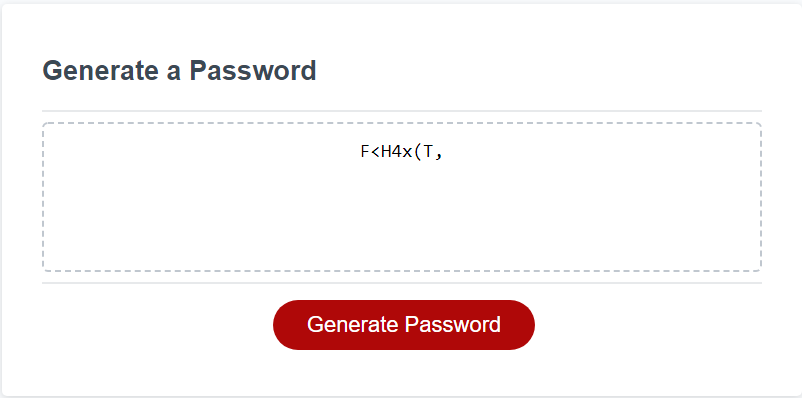

# Challenge-3-PasswordGenerator
Website that host a password generator. Asks for a set of parameters, then generates a password of random characters that follow suite.

# Images
 password generator asking for perameters of password

 password being generated

# Website link:
* https://alu1868.github.io/Challenge-3-PasswordGenerator/

# github link:
* https://github.com/alu1868/Challenge-3-PasswordGenerator

# Author
* https://github.com/alu1868

# Starter code link:
* https://github.com/coding-boot-camp/friendly-parakeet

# Credits
* HTML
* CSS
* JavaScript

# Acceptance Criteria
1) when I click the button, a password generates, a prompt is given

2) when prompt is given, I select which criteria i want

3) when prompted for length, password must be between 8 and 128 characters long

4) when asked for character types to include in the password
    - upper case letters
    - lower case letters
    - numbers
    - special characters

5) atleast one character is prominent in the password when selected

6) when pompts are answered password is generated and meets criteria

7) when password is generated it is either displayed on the page or written as an alert